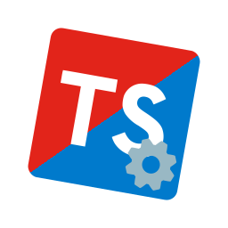

# TypeScript Config



[](https://npmjs.com/package/@isentinel/tsconfig)
[](https://github.com/christopher-buss/tsconfig/blob/main/LICENSE.md)

A comprehensive and strict TypeScript configuration that enforces modern,
type-safe development practices. Seamlessly implement robust typing standards
across projects by utilizing cutting-edge TypeScript features and safety checks.

This config delivers a future-ready TypeScript setup through multiple optimized
configurations, ensuring maximum type safety and compatibility with modern
JavaScript runtimes and Roblox development environments.

## Installation

1. Install package:

```sh
pnpm add --save-dev typescript @isentinel/tsconfig
```

2. Create TypeScript configuration file `tsconfig.json` in the root of your
   project, choosing the appropriate configuration:

For standard TypeScript projects:

```json
{
	"extends": "@isentinel/tsconfig/typescript"
}
```

For Roblox projects:

```json
{
	"extends": "@isentinel/tsconfig/roblox"
}
```

## See also

- [`@isentinel/eslint-config`](https://github.com/christopher-buss/eslint-config)
- Original project:
  [`@azat-io/typescript-config`](https://github.com/azat-io/typescript-config)

## License

MIT &copy; [Christopher Buss](https://github.com/christopher-buss)

Original work &copy; [Azat S.](https://azat.io)
